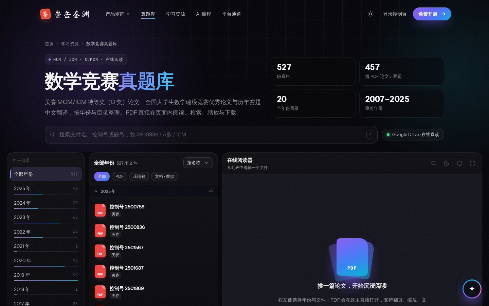
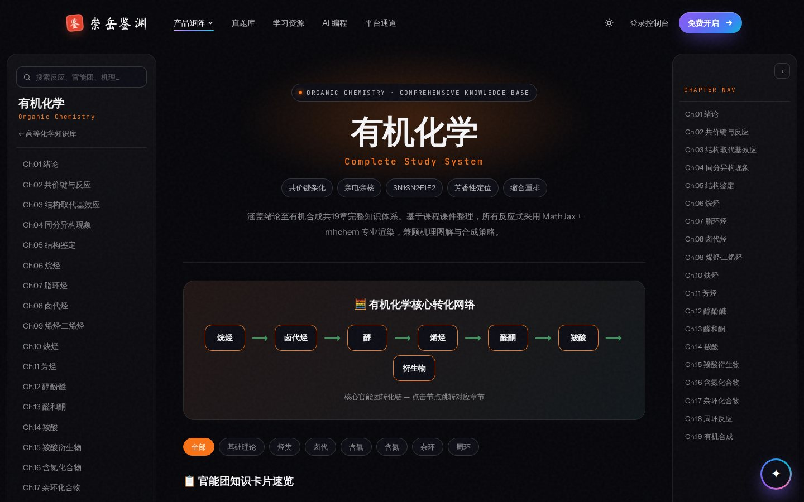
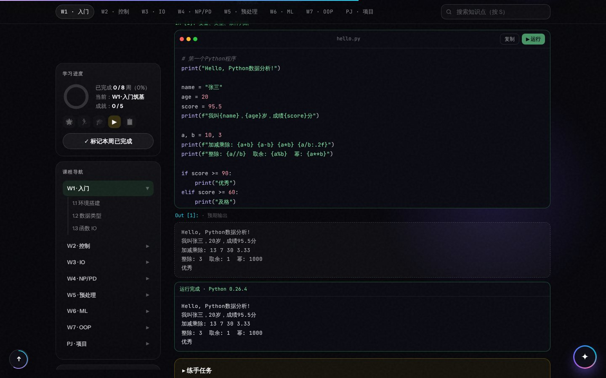
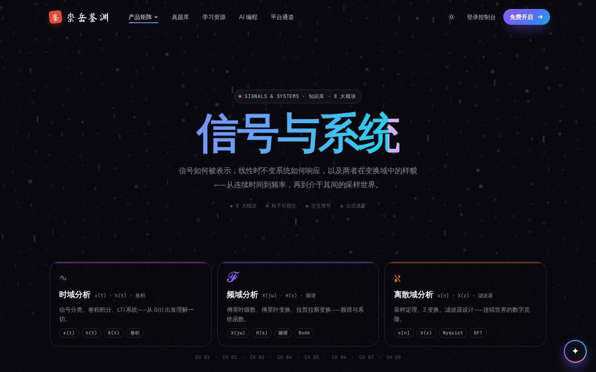
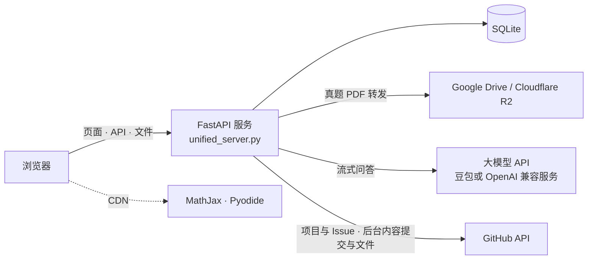

<div align="center">


# 崇岳鉴渊

**面向理工科大学生的开放学习与科研资源平台**

数学建模竞赛论文在线阅读 · 理工科课程知识库 · Python 与 AI 编程实践 · 开源科研入门

[在线访问](https://chongyue-jianyuan.onrender.com) · [功能概览](#功能概览) · [本地运行](#本地运行) · [部署指南](docs/deployment.md) · [开发文档](docs/development.md)


</div>


## 简介

崇岳鉴渊是一个面向理工科大学生的学习网站。它把平时散落在网盘、群文件和各类博客里的学习资料，整理成可以直接在浏览器里阅读、搜索和练习的内容：

- 在网页里直接阅读美赛（MCM/ICM）O 奖论文和历年赛题，不用先下载压缩包；
- 按章节学习高等数学、信号与系统和高等化学，公式、推导和练习题都在页面上；
- 跟着 8 周的 Python 数据分析课程做项目，代码在浏览器里就能运行；
- 学习用 AI 辅助编程，了解如何为真实的开源项目提交第一个 PR；
- 遇到问题时，随时向每个页面右下角的 AI 学术助教提问。

网站的大部分内容无需登录即可浏览。注册账号后可以收藏资源、记录学习进度；所有页面都提供深色和浅色两种主题，并适配手机浏览。

## 功能概览

| 板块 | 内容 |
|------|------|
| [**数学竞赛真题库**](https://chongyue-jianyuan.onrender.com/math/) | 2007–2025 年美赛 O 奖论文、全国大学生数学建模竞赛优秀论文与 2006–2020 年美赛赛题中文翻译，共 500 余个文件。支持按年份和类型筛选、全局搜索；PDF 在页面内直接阅读，可翻页、缩放、文内查找和切换夜间模式 |
| [**高等数学**](https://chongyue-jianyuan.onrender.com/math-hub) | 微积分、线性代数、概率论三条主线，用粒子动画和交互推导解释抽象概念，并给出按学期推进的学习路线 |
| [**信号与系统**](https://chongyue-jianyuan.onrender.com/signals-and-systems) | 时域、频域、离散域 8 个模块：卷积、傅里叶级数与变换、拉普拉斯变换、Z 变换、采样与滤波，每个模块都有交互推导 |
| [**高等化学**](https://chongyue-jianyuan.onrender.com/chemistry) | 有机、无机、物理化学、分析化学、生物化学五份讲义（有机化学共 19 章）。反应式和公式由 MathJax 渲染，支持全文搜索、章节导航和随堂测验 |
| [**Python 数据分析**](https://chongyue-jianyuan.onrender.com/python-course) | 8 周课程、8 个实战项目（从成绩计算器到房价预测、鸢尾花分类）。代码块通过 Pyodide 在浏览器中直接运行，自动记录学习进度 |
| [**AI 编程专区**](https://chongyue-jianyuan.onrender.com/ai-coding) | AI 开发者成长路线：从写好 Prompt，到让 Agent 规划、编码、测试和提交；包含技能自测、阶梯式实战项目和可直接复制的提示词模板 |
| [**科研孵化**](https://chongyue-jianyuan.onrender.com/research) | 实时展示 AI 与数据科学领域的 GitHub 高星项目和可认领的 Good First Issue，演示从 Fork 到 Merge 的完整贡献流程，并整理科研与论文写作资料 |
| [**学习资源库**](https://chongyue-jianyuan.onrender.com/knowledge) | 课件、真题、论文模板与备考资料，按分类和标签整理，支持关键词搜索、在线预览、收藏和进度标记 |
| [**多维知识库**](https://chongyue-jianyuan.onrender.com/knowledge-base) | 计算机、数学、信号与系统、化学、数据科学等 9 个学科的知识专题入口 |
| **AI 学术助教** | 位于所有页面右下角。接入大模型回答学科和平台问题，支持多轮对话、公式与代码渲染，勾选「搜文件」可检索站内学习资源 |
| [**账户与社区**](https://chongyue-jianyuan.onrender.com/login) | 注册登录、个人中心（收藏、学习进度、资料与密码）、学长学姐经验分享，以及科研孵化圈的申请与后台审核 |
| **管理后台** | 管理员直接在网页上维护网站：编辑任意页面（实时预览、历史版本）、上传文档和图片、增删学习资源及附件、刷新真题目录，以及管理用户和审核申请。修改保存到 GitHub 仓库，实例重启后不会丢失 |

## 界面预览

<table>
  <tr>
    <td width="50%"><br><sub><b>数学竞赛真题库</b>　按年份浏览，PDF 在页面内阅读</sub></td>
    <td width="50%"><br><sub><b>高等化学</b>　章节导航、知识卡片与反应式渲染</sub></td>
  </tr>
  <tr>
    <td><br><sub><b>Python 数据分析</b>　代码在浏览器中直接运行</sub></td>
    <td><br><sub><b>信号与系统</b>　8 个模块的交互推导</sub></td>
  </tr>
  <tr>
    <td><br><sub><b>AI 学术助教</b>　在任意页面随时提问</sub></td>
    <td><br><sub><b>移动端</b>　全站适配手机浏览</sub></td>
  </tr>
</table>

## 本地运行

需要 Python 3.10 及以上版本（线上环境为 3.12）。

```bash
git clone https://github.com/hanjiongmin-stack/chongyue-jianyuan.git
cd chongyue-jianyuan
pip install -r requirements.txt
python unified_server.py
```

启动后访问 <http://127.0.0.1:8888>。

- 首次启动会自动创建 SQLite 数据库（`data/chongyue.db`），并写入示例分类、标签和学习资源。
- 同时会创建管理员账号 `admin`，密码取环境变量 `CYJY_ADMIN_PASSWORD`；未设置时为 `admin123`，只适合本地开发。登录后导航栏右上角会出现「管理后台」入口（地址为 `/admin`）。
- AI 助教的大模型问答、真题 PDF 在线阅读等功能需要额外配置，见 [部署指南 · 环境变量](docs/deployment.md#环境变量)。也可以把变量写进项目根目录的 `.env` 文件（参考 `.env.example`），启动时会自动读取。

## 部署

线上站点运行在 [Render](https://render.com) 的免费实例上，仓库自带 `render.yaml`：

1. Fork 本仓库，在 Render 中选择 **New → Blueprint** 导入（会读取 `render.yaml`）；
2. 在 Environment 中设置 `CYJY_ADMIN_PASSWORD`（至少 8 位，线上不设置时不会创建管理员账号），按需配置 AI、真题阅读和管理后台内容管理（`CYJY_GITHUB_TOKEN`）相关的变量；
3. 部署完成后访问 `/health` 确认服务正常。可以用 UptimeRobot 定时访问，避免免费实例休眠。

> [!NOTE]
> Render 免费实例的磁盘是临时的：没有设置 `DATABASE_URL` 时，数据库位于 `/tmp`，实例重启、重新部署或休眠后唤醒都会被重置，注册用户、收藏等数据不会保留。把 `DATABASE_URL` 设为一个外部 Postgres 数据库（如 Neon 的免费数据库）即可长期保存，见 [数据与持久化](docs/deployment.md#数据与持久化)。通过管理后台修改的页面、学习资源和上传的文件保存在 GitHub 仓库中，不受影响，见 [开启管理后台的内容管理](docs/deployment.md#开启管理后台的内容管理)。

完整步骤、全部环境变量和常见问题见 [部署指南](docs/deployment.md)。

## 技术架构



| 层次 | 技术 |
|------|------|
| 后端 | FastAPI、Uvicorn、SQLAlchemy 2；数据库默认 SQLite（WAL 模式），线上可通过 `DATABASE_URL` 使用 Postgres |
| 认证与安全 | JWT（python-jose）、bcrypt、接口限流、安全响应头 |
| 前端 | 原生 HTML / CSS / JavaScript，无需构建；全站共用 `static/assets/cyjy.css` 与 `cyjy.js`，导航和页脚等公共片段由服务端注入 |
| 阅读与计算 | PDF.js（随仓库分发）、MathJax 3、Pyodide |
| 部署 | Render（`render.yaml`）、UptimeRobot 保活 |

目录结构、接口列表和数据模型见 [开发文档](docs/development.md)。

## 参与贡献

欢迎通过 Issue 报告问题、提出建议，或者直接提交 Pull Request 补充学习资料和修复问题。开始之前请先阅读 [贡献指南](CONTRIBUTING.md)。

## 许可证

本项目基于 [MIT 许可证](LICENSE) 开源。

## 致谢

网站使用了 [FastAPI](https://fastapi.tiangolo.com)、[PDF.js](https://mozilla.github.io/pdf.js/)、[MathJax](https://www.mathjax.org)、[Pyodide](https://pyodide.org) 等开源项目，感谢这些项目的作者与维护者。
